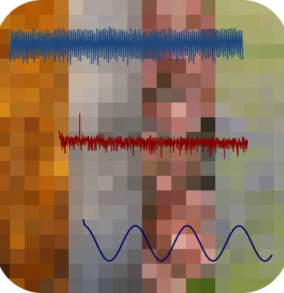
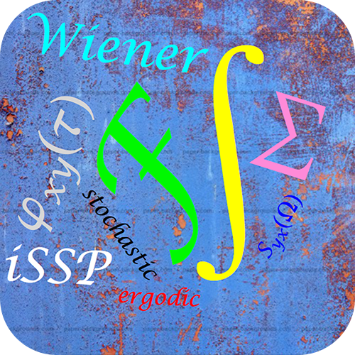

<table style="margin:0px auto; border:0px">
	<tr style="text-align:center; border:0px">
		<td style="text-align:center; padding:10px 20px;
			border:2px steelblue solid; border-radius:25px;">
		<a href="https://socratic-software.github.io/stochastica/">
		
		 
		StochasticA 26 Laboratory Experiments</a></td>
		<td>&nbsp;&nbsp;&nbsp;&nbsp;</td>
		<td style="text-align:center; padding:10px 20px;
			border:2px steelblue solid; border-radius:25px;">
		<a href="https://apps.apple.com/us/app/stochastic-signal-processing/id1450268179">
		
		 
		StochasticS 58 Laboratory Experiments</a></td>
	</tr>
</table>

# StochasticA

## Background
This repository contains the *iBook* / website for *Introduction to Stochastic Signal Processing*. The short name is *StochasticA*.

Speech, music, seismic vibrations, oil prices, and climate measurements are all examples of stochastic (random) signals. In this textbook, intended for individuals with prior training in introductory signal processing and introductory probability theory, we develop techniques to process such signals to extract useful information. We present case studies ranging from music to photographic images to oil prices to climate data to the motion of individual biomolecules.
  
This textbook, as an interactive textbook (*iBook*), makes use of your device's ability to display dynamic information through images, films, and animations and to hear the results of the techniques applied to music. At the end of every chapter there are homework problems ranging from easy to "olympic".
  
A new and exciting aspect is that we make use of your device's interactive capabilities to offer 26 laboratory experiments in signal processing. For the web-based implementation in this repository, the experiments use the speakers, display, and the graphical user interface (GUI). For a tablet and smartphone implementation that can be found [here](https://apps.apple.com/us/app/stochastic-signal-processing/id1450268179?ls=1), this is extended to use the camera and the microphone providing a total of 59 laboratory experiments.
  
These experiments are not simulations; they are examples of real digital processing of signals in your device. In this time of at-home and online learning, this is the way to learn signal processing through study and experimentation.

## IPR
Unless otherwise specified, *html* files are copyrighted and do not fall under the MIT License. Javascript (*js*) files do, in general, fall under the MIT License unless explicitly stated otherwise.

## Privacy Policy
Our *Privacy Policy* can be found [here](https://sites.google.com/socraticsoftware.org/socraticsoftware/privacy-policy)

## Chapter Contents

1. How to use this iBook
1. Prologue
1. Introduction
1. Characterization of Random Signals
1. Correlations and Spectra
1. Filtering of Stochastic Signals
1. The Langevin Equation &mdash; A Case Study
1. Characterizing Signal-to-Noise Ratios
1. The Matched Filter
1. The Wiener filter
1. Aspects of Estimation
1. Spectral Estimation
1. Appendices
1. Information

*Last revision this document: 11 June 2021*
